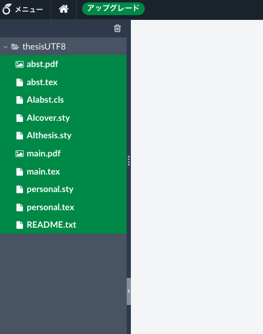
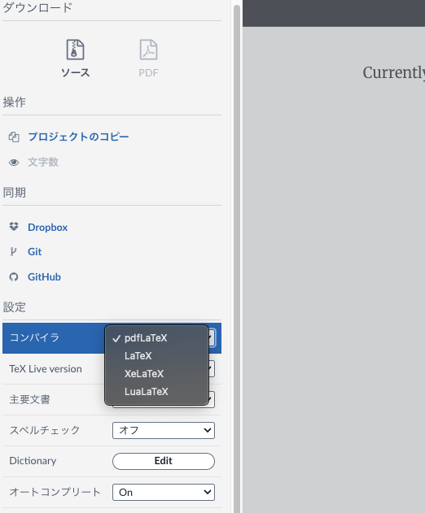
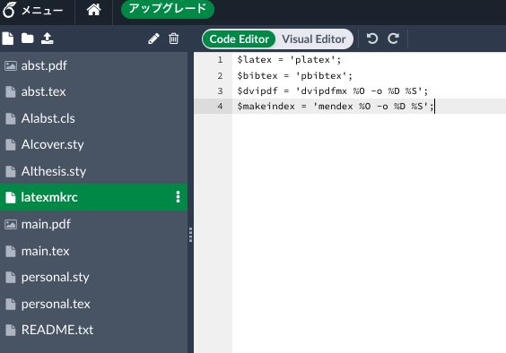

# overleafで日本語使えるようにする
最初わかっていなかったらわんちゃん沼るので共有

- [https://ja.overleaf.com/project](https://ja.overleaf.com/project)に行きます
- `新規プロジェクト`
- `プロジェクトのアップロード`
- 任意のプロジェクトファイル`*.zip`を選択

おそらく、卒論のテンプレート`thesisUTF8`ではエラーが出るはず。<br>
やることは3つ。
- ~~ディレクトリから出す~~
- コンパイラを `pdfLaTeX` → `LaTeX` 
- `latexmkrc`ファイルを追加

## ディレクトリから出す
`thesisUTF8`下のファイルを全てプロジェクトの直下に移動する。移動した後は`thesisUTF8`は空なので、削除していい。

`latexmkrc`がプロジェクト直下にあれば問題ないので、ディレクトリから出す必要性はあまりないが、個人的にこっちの方が作業しやすいのでそうしている。



## コンパイラを `pdfLaTeX` → `LaTeX` 
左上の`メニュー`からコンパイラを変更する



## `latexmkrc`ファイルを追加
左上のファイルアイコンから新規ファイルを作成して`latexmkrc`というファイルを作成する
```
$latex = 'platex';
$bibtex = 'pbibtex';
$dvipdf = 'dvipdfmx %O -o %D %S';
$makeindex = 'mendex %O -o %D %S';
```
ファイルに以上4行をペースト



## 終わり
コンパイルするとできているはず。

基本的には、`main.tex`を編集するが、`main.tex`は`abst.pdf`を参照して2ページ目の概要を複製しているので、概要の編集は`abst.tex`をコンパイルしてpdfに保存し、`abst.pdf`アップロードすることで、`main.tex`の概要が変更される。

ちなみに、`main.pdf`と`README.txt`は不要なファイルなので削除してもいい。